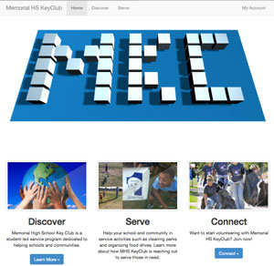

KeyClub Website
===============

Website for organizing school Keyclub events. Written in Java, Javascript, CSS, HTML. Built on Google App Engine.

Features
----------
- User sign up
- Connect with facebook
- Event creation and registration
- Hours management
- Fancy three.js intro animation
- AJAX requests

Installation
-------------
Please setup ```wynd.mhskc.Facebook``` with the appropriate Facebook App keys. Deploy on Google App Engine.

License
--------

Copyright 2014 Yu Xuan Liu. All rights reserved. Content licensed under the [GNU General Public License v3.0](LICENSE)
